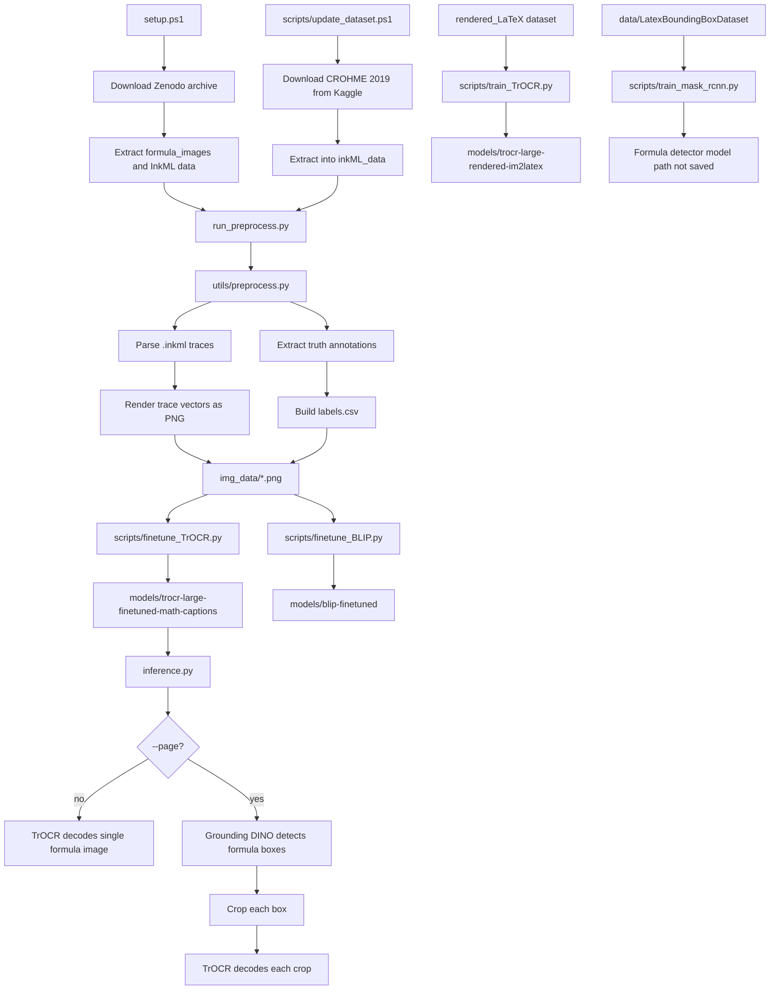
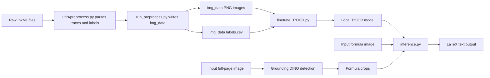

# Math2LaTeX Codebase Flow Report

## Purpose

Math2LaTeX is a handwritten/math-image OCR project. Main goal: turn formula images or full-page scans into LaTeX strings. Codebase has four main flows:

1. Environment setup and dependency install
2. Dataset download/update
3. InkML preprocessing into PNG images plus labels
4. Model training and inference

## High-level architecture



## File-by-file flow

### `pyproject.toml`

Defines project metadata and dependencies.

Key dependencies:

- `torch`, `torchvision`, `torchaudio`, `torch-directml` for model training/inference
- `transformers`, `peft` for Hugging Face models
- `pillow`, `opencv-python`, `scikit-image`, `matplotlib` for image handling/rendering
- `pandas`, `numpy`, `scikit-learn` for dataset metadata and splits
- `rectpack`, `scipy` for synthetic page/layout utilities

Python range: `>=3.12,<3.13`.

### `setup.ps1`

Bootstrap script for original dataset prep.

Flow:

1. Downloads Zenodo `files-archive.zip` if missing.
2. Extracts archive into project root.
3. Extracts `formula_images.tar.gz` if present.
4. Extracts `archive.zip` into `inkML_data` if present.
5. Flattens nested InkML folder structure.
6. Ensures `inkML_data\CROHME_training_2011` exists.
7. Runs `python run_preprocess.py`.

This script prepares raw data before preprocessing.

### `scripts/update_dataset.ps1`

Dataset update script for CROHME 2019.

Flow:

1. Creates `inkML_data` if missing.
2. Downloads Kaggle CROHME 2019 zip.
3. Extracts zip into `inkML_data`.
4. Deletes downloaded zip.
5. Tells user to run `python run_preprocess.py`.

This script updates raw InkML data, but does not preprocess directly.

### `run_preprocess.py`

Entry point for preprocessing InkML into training data.

Flow:

1. Calls `utils.preprocess.ink2img_folder()` with four default InkML folders:
   - `inkML_data/TrainINKML_2013`
   - `inkML_data/trainData_2012_part1`
   - `inkML_data/trainData_2012_part2`
   - `inkML_data/CROHME_training_2011`
2. Writes output into `img_data`.
3. Loads `img_data/labels.csv`.
4. Checks:
   - image count generated
   - duplicate numbered output files are absent
   - every CSV image name exists in `img_data`
   - labels are parsed LaTeX strings, not corrupted `.ink` content

Output:

- `img_data/*.png`
- `img_data/labels.csv`

### `utils/preprocess.py`

Core InkML parser and renderer.

Important functions:

#### `get_traces_data(inkml_file_abs_path)`

Parses `.inkml` files.

Flow:

1. Reads XML with InkML namespace.
2. Extracts every `<trace>` coordinate list.
3. Converts coordinate strings into numeric point arrays.
4. Sorts traces by ID.
5. Maps `<traceGroup>` labels to referenced trace vectors.
6. Returns semantic symbols and their stroke paths.

#### `get_gt(inkml_file_abs_path)`

Extracts ground-truth formula from annotation:

```xml
<annotation type="truth">...</annotation>
```

Raises error if truth annotation missing.

#### `inkml2img(input_path, output_path)`

Renders one InkML file to one PNG.

Flow:

1. Parses trace vectors with `get_traces_data()`.
2. Draws all strokes with Matplotlib.
3. Removes axes/ticks.
4. Inverts y-axis to match handwriting layout.
5. Saves PNG to output directory.

#### `ink2img_folder(input_paths, output_path)`

Batch preprocessing driver.

Flow:

1. Iterates input folders.
2. Finds `.inkml` files.
3. Reads truth label with `get_gt()`.
4. Computes stable image filename.
5. Calls `inkml2img()`.
6. Writes labels dataframe to `labels.csv`.

### `utils/latex.py`

Image and LaTeX helper utilities.

Important functions:

#### `crop_to_formula(image, padding=30, max_width=6, line_colors=..., max_lines=5)`

Crops formula image around dark pixels and adds synthetic line artifacts.

Flow:

1. Finds black/dark pixels.
2. Converts alpha to opaque white.
3. Crops around detected formula content with padding.
4. Randomly creates horizontal line mask.
5. Rotates mask slightly.
6. Overlays random line color.
7. Returns RGB cropped/augmented image.

Used by rendered-LaTeX training script imports.

#### `renderedLaTeXLabelstr2Formula(label)`

Cleans rendered-LaTeX labels by removing:

- `\label{...}`
- `\,`

#### `display_formula(latex)`

Prints formula after removing `\mbox{...}` artifacts.

#### `generate_page(images, ...)`

Synthesizes full-page layout from formula images.

Flow:

1. Packs formula image rectangles into paper size with `rectpack`.
2. Creates white paper canvas.
3. Optionally adds ruled-paper lines.
4. Pastes each formula image at packed position.
5. Returns page image plus bounding boxes.

This supports object-detection/full-page training data generation, though current listed scripts do not fully wire it into training.

## Training flows

### `scripts/finetune_TrOCR.py`

Fine-tunes TrOCR on preprocessed InkML images in `img_data`.

Flow:

1. Prompts user for GPU backend:
   - AMD DirectML
   - NVIDIA CUDA
   - CPU fallback
2. Loads base Hugging Face model:
   - `microsoft/trocr-base-handwritten`
3. Defines `MathCaptionsDataset` over:
   - `img_data/*.png`
   - `img_data/labels.csv`
4. Splits CSV into train/validation sets.
5. Applies training augmentations:
   - brightness/contrast jitter
   - small affine transform
   - optional Gaussian blur
6. Tokenizes LaTeX captions to max length 256.
7. Trains for 1 epoch with AdamW.
8. Evaluates validation loss.
9. Saves model, processor, and history JSON files to:

```text
models/trocr-large-finetuned-math-captions
```

Note: output directory name says `large`, but loaded model is `microsoft/trocr-base-handwritten`.

### `scripts/finetune_BLIP.py`

Alternative BLIP VQA-style training path.

Flow:

1. Prompts user for GPU backend.
2. Loads:
   - `Salesforce/blip-vqa-base`
3. Uses prompt:

```text
What does the formula above say?
```

4. Loads `img_data/labels.csv` and image files.
5. Feeds image + question as BLIP input.
6. Uses LaTeX label as answer target.
7. Trains for 5 epochs.
8. Saves model and history JSON files to:

```text
models/blip-finetuned
```

This is separate from main inference path. `inference.py` does not load BLIP.

### `scripts/train_TrOCR.py`

Older/alternate TrOCR training flow using rendered LaTeX dataset, not `img_data`.

Flow:

1. Loads `microsoft/trocr-large-handwritten`.
2. Reads rendered dataset metadata:
   - `../rendered_LaTeX/processed_im2latex_train.lst`
   - `../rendered_LaTeX/processed_im2latex_val.lst`
   - `../rendered_LaTeX/im2latex_formulas.lst`
3. Uses external dataset class:
   - `data.datasets.renderedLaTeXDataset`
4. Applies stronger image augmentation:
   - random affine
   - color jitter
5. Trains for 2 epochs.
6. Saves model and `.pt` history files to:

```text
../models/trocr-large-rendered-im2latex
```

This path depends on files/classes outside listed files.

### `scripts/train_mask_rcnn.py`

Object detection training skeleton for formula bounding boxes.

Flow:

1. Expects dataset directory:

```text
data/LatexBoundingBoxDataset
```

with:

```text
images/
masks/
```

2. Loads Faster R-CNN MobileNet v3 320 FPN pretrained weights.
3. Replaces classifier head for 2 classes:
   - background
   - latex
4. Builds train/test split.
5. Runs training loop.

Current limitation:

- Dataset target construction is incomplete.
- Mask-to-box conversion is commented out.
- Returned `target` is empty.
- Script does not save trained detector.

Because of this, this script is a prototype, not ready full training pipeline.

## Inference flow

### `inference.py`

Main runtime OCR script.

CLI usage shape:

```bash
python inference.py <image> --model models/trocr-large-finetuned-math-captions
python inference.py <image> --model models/trocr-large-finetuned-math-captions --page
```

Important functions:

#### `load_trocr(model_dir)`

Loads and caches TrOCR processor/model from local model directory.

- Uses CUDA if available, else CPU.
- Cache size 2.

#### `load_dino()`

Loads and caches Grounding DINO for formula detection.

Model:

```text
IDEA-Research/grounding-dino-base
```

Prompt text:

```text
math formula
```

#### `decode_formula(image, processor, model, device)`

Runs TrOCR generation on one PIL image and decodes output tokens into LaTeX string.

#### `detect_boxes(image, dino_processor, dino_model, device)`

Runs Grounding DINO on full-page image and returns bounding boxes.

Thresholds:

- `box_threshold=0.3`
- `text_threshold=0.3`

#### `recognize(image_path, model_dir, is_page=False)`

Main inference controller.

Single formula mode:

1. Opens image as RGB.
2. Loads TrOCR.
3. Decodes whole image.
4. Prints one LaTeX result.

Full-page mode:

1. Opens image as RGB.
2. Loads TrOCR.
3. Loads Grounding DINO.
4. Detects formula boxes.
5. Crops each detected box.
6. Decodes each crop with TrOCR.
7. Prints indexed LaTeX results.

## End-to-end pipeline



## Main codebase flow summary

1. `setup.ps1` or `scripts/update_dataset.ps1` gets raw datasets.
2. `run_preprocess.py` calls `utils/preprocess.py` to convert InkML handwriting traces into PNG formula images and `labels.csv`.
3. `scripts/finetune_TrOCR.py` trains TrOCR on `img_data` and saves local model artifacts.
4. `inference.py` loads saved TrOCR model and predicts LaTeX from input images.
5. If `--page` is used, `inference.py` first uses Grounding DINO to detect formula regions, then runs TrOCR on each crop.
6. `utils/latex.py` provides helper functions for formula cropping, label cleanup, display, and synthetic page generation.
7. `scripts/finetune_BLIP.py` is alternate experimental VQA model path.
8. `scripts/train_TrOCR.py` is alternate rendered-LaTeX training path.
9. `scripts/train_mask_rcnn.py` is an unfinished detector-training prototype.

## Current risks and gaps

- `scripts/train_mask_rcnn.py` has incomplete target generation, so detector training cannot work correctly yet.
- `scripts/finetune_TrOCR.py` saves to `trocr-large-finetuned-math-captions` while loading `trocr-base-handwritten`, which can confuse model tracking.
- `inference.py --page` uses Grounding DINO directly, not locally trained Mask/Faster R-CNN detector.
- Some scripts rely on external modules/files not included in requested list, especially `data.datasets` and rendered-LaTeX metadata.
- BLIP training exists but is not connected to inference.
- Preprocessing uses Matplotlib global figure state, so failures or parallel runs may need care.
